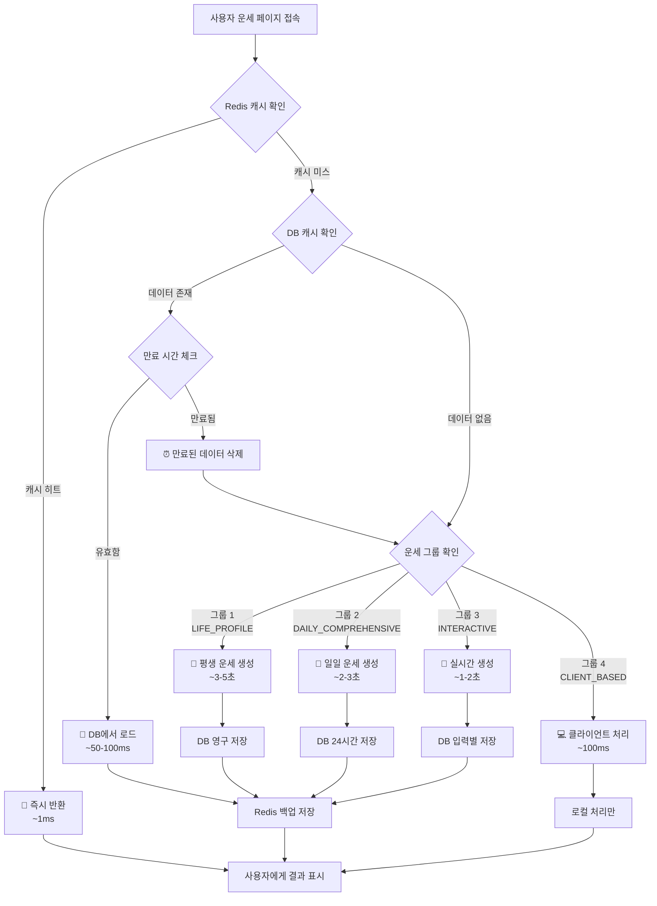

# 행운 (Fortune Compass)

**모든 운명은 당신의 선택에 달려있습니다.**

`행운`은 전통적인 지혜와 최신 AI 기술을 결합하여 사용자에게 깊이 있는 개인 맞춤형 운세 경험을 제공하는 풀스택 애플리케이션입니다. Google Genkit을 활용한 AI 분석을 통해, 당신의 삶에 대한 통찰력을 얻고 미래를 탐험하는 나침반이 되어 드립니다.

---

## ✨ 앱 소개 및 데모

- **[🔗 실시간 웹 데모](https://fortune-explorer.vercel.app)**

---

## 🏛️ 웹 애플리케이션 아키텍처

`행운`은 사용자가 방대한 운세 콘텐츠를 쉽고 직관적으로 탐색할 수 있도록 사용자 중심의 아키텍처로 설계되었습니다.

### 1. 사용자 중심 정보 구조 (IA)

기능들을 사용자 의도에 따라 재분류하여, 누구나 원하는 정보를 쉽게 찾을 수 있도록 구성했습니다.

- **핵심 운세 서비스:** 매일 확인하는 운세부터 심층 분석, 사용자가 직접 참여하는 인터랙티브 운세까지 운세의 핵심 기능을 그룹화했습니다.
- **특별 콘텐츠:** 연애, 취업 등 특정 상황에 대한 운세와 연예인 궁합 같은 흥미 위주 콘텐츠를 분리하여 제공합니다.
- **나의 운세 기록:** 과거 운세 기록과 통계 분석을 통해 자신의 운세 흐름을 추적하고 관리하는 개인화된 공간입니다.

### 2. 최적의 온보딩 경험

신규 사용자가 서비스의 가치를 빠르게 느끼고 이탈하지 않도록, `최소한의 노력으로 최대의 가치를 경험`하는 4단계 온보딩 프로세스를 설계했습니다.

1.  **간편 로그인:** 소셜 로그인으로 진입 장벽 최소화
2.  **핵심 정보 입력:** 정확한 운세 분석을 위한 필수 정보(생년월일) 입력
3.  **추가 정보 입력 (선택):** 더 깊은 개인화를 위한 MBTI, 출생 시간 등 선택적 정보 입력
4.  **즉각적인 가치 제공:** 정보 입력 즉시 **오늘의 총운**을 제공하여 서비스의 효용성을 바로 체감

### 3. 개인화 대시보드

로그인 후 가장 먼저 마주하는 메인 페이지는 위젯 기반의 개인화 허브로 작동합니다.

- **오늘의 운세 요약:** 가장 중요한 오늘의 운세를 상단에 고정 노출합니다.
- **맞춤 운세 피드:** MBTI, 별자리 등 개인화된 운세를 카드 형태로 제공합니다.
- **빠른 실행 도구:** 타로카드, 관상 분석 등 자주 사용하는 인터랙티브 기능에 빠르게 접근합니다.

### 4. 직관적인 네비게이션 시스템

모바일 웹 환경에 최적화된 **하단 탭 바 (Bottom Tab Bar)**를 통해 앱의 핵심 기능에 언제나 쉽게 접근할 수 있습니다.

- **🏠 홈:** 개인화된 대시보드
- **🧭 전체 운세:** 앱의 모든 운세 서비스를 체계적으로 탐색하는 라이브러리
- **✨ 스페셜:** 흥미 위주, 주제별 운세 등 특별 콘텐츠
- **📊 나의 기록:** 과거 운세 기록과 통계 분석
- **👤 프로필:** 계정 정보 및 설정

---

## 🌟 주요 기능 (Key Features)

사용자 중심의 정보 구조에 따라 재구성된 `행운`의 주요 기능입니다.

### 🔮 핵심 운세 서비스

#### 매일의 운세 (Daily Fortune)
- 오늘의 총운
- MBTI 유형별 일일/주간/월간 운세
- 띠별/별자리별 운세

#### 심층 분석 (In-depth Analysis)
- 사주팔자 상세 분석
- 토정비결 (연간 운세)
- 주역점 (상황별 운세)
- 풍수지리 (거주지, 사무실 분석)

#### 인터랙티브 운세 (Interactive Tools)
- 타로카드 (AI 기반 해석)
- 관상 분석 (AI 얼굴 분석)
- 손금 분석
- 꿈해몽 (키워드, 상황별 해석)

### ✨ 특별 콘텐츠

- **주제별 운세:** 연애/결혼/이별, 취업/시험/승진, 재물/금전 운세, 로또 번호 추천
- **흥미 위주 운세:** 연예인과의 궁합 분석, 이름풀이 및 작명, SNS 닉네임 운세, 반려동물 사주

### 📊 나의 운세 기록

- **히스토리:** 모든 운세 결과를 날짜별로 저장하고 과거 운세와 비교
- **통계 분석:** 운세 결과를 차트와 그래프로 시각화하여 운의 흐름 추적

### 👤 사용자 중심 기능

- **프로필 시스템:** 이름, 생년월일, MBTI, 성별, 출생 시간 등 개인화 정보 관리
- **소셜 로그인:** Google, 카카오를 통한 간편 인증
- **소셜 공유:** 운세 결과를 Instagram, Facebook 등 소셜 미디어에 공유
- **푸시 알림 및 위젯:** 일일 운세 알림, 홈스크린 위젯 지원

---

## 🎨 디자인 시스템

### Liquid Glass UI (2025 iOS 26 Design)

**컨셉**: 미래지향적 글라스모피즘과 뉴모피즘의 결합
- **Primary Color:** `Deep Dark (#171717)` - 고급스러운 어둠
- **Secondary Color:** `Glass Light (#F1F5F9)` - 투명한 밝음  
- **Background:** `Pure Dark (#0A0A0B)` - 깊은 어둠
- **Glass Effects:** 반투명 배경 + 백드롭 블러 + 정교한 섀도우
- **Typography:** SF Pro 폰트 시스템 (애플 디자인 언어)

### 핵심 디자인 원칙

1. **Glass Morphism**: 반투명 배경과 백드롭 블러 효과
2. **Neumorphism**: 정교한 inset/outset 섀도우로 입체감 구현
3. **Micro Interactions**: 부드러운 scale, shimmer, float 애니메이션
4. **Accessibility**: WCAG 2.1 AA 준수, 고대비 색상 시스템
5. **Future-Ready**: 2025년 트렌드를 반영한 미래지향적 UI

### 컴포넌트 시스템

- **Glass Button**: 복층 섀도우와 백드롭 블러 효과
- **Glass Card**: 투명한 배경과 정교한 테두리 처리
- **Glass Navigation**: 플로팅 네비게이션 바
- **Typography**: SF Pro Display/Text 폰트 패밀리

---

## 🧠 AI 운세 시스템 아키텍처

`행운`은 비용 효율성과 사용자 경험을 동시에 최적화하기 위해 운세 데이터를 4개 그룹으로 분류하여 관리합니다.

### 그룹 1: 고정 정보 (평생 변하지 않는 운세)
**최초 1회 통합 생성으로 API 비용 최소화**

**대상 페이지:**
- `/fortune/saju` (기본 사주)
- `/fortune/traditional-saju` (전통 사주)
- `/fortune/tojeong` (토정비결)
- `/fortune/past-life` (전생)
- `/fortune/personality` (타고난 성격)
- `/fortune/destiny` (운명의 수레바퀴)
- `/fortune/salpuli` (살풀이)
- `/fortune/five-blessings` (오복)
- `/fortune/talent` (타고난 재능)

**처리 프로세스:**
1. 사용자가 위 페이지 중 하나에 최초 진입
2. DB에서 `fortune_type: 'LIFE_PROFILE'` 데이터 존재 여부 확인
3. **Cache Hit**: DB에서 즉시 로딩 (API 호출 없음)
4. **Cache Miss**: `generateLifeProfile` Flow로 모든 고정 운세를 한 번에 생성하여 DB 저장

### 그룹 2: 일일 정보 (매일 바뀌는 운세)
**배치 처리를 통한 사전 생성으로 실시간 응답 보장**

**대상 페이지:**
- `/fortune/daily`, `/fortune/tomorrow`, `/fortune/hourly`
- `/fortune/wealth`, `/fortune/love`, `/fortune/career`
- `/fortune/lucky-*` (행운의 숫자, 색상, 음식, 아이템 등)
- `/fortune/biorhythm`, `/fortune/zodiac-animal`, `/fortune/mbti`

**처리 프로세스:**
1. **매일 자정 배치 실행**: Supabase Edge Function 스케줄러 작동
2. **전체 사용자 대상 통합 생성**: `generateComprehensiveDailyFortune` Flow로 하루치 모든 운세를 한 번에 생성
3. **DB 저장**: `fortune_type: 'DAILY_COMPREHENSIVE'`로 24시간 유효 데이터 저장
4. **사용자 요청 시**: DB에서 필요한 부분만 파싱하여 즉시 응답 (API 호출 없음)

### 그룹 3: 실시간 상호작용 (사용자 입력 기반)
**사용자별 맞춤 입력에 따른 실시간 생성 + 결과 캐싱**

**대상 페이지:**
- `/interactive/dream-interpretation` (꿈 해몽)
- `/interactive/tarot` (타로점)
- `/interactive/worry-bead` (고민 구슬)
- `/fortune/compatibility`, `/fortune/couple-match`, `/fortune/celebrity-match`

**처리 프로세스:**
1. 사용자 입력 수집 (꿈 내용, 타로 질문, 상대방 정보 등)
2. 입력값 해시로 DB 캐시 조회
3. **Cache Hit**: 기존 결과 즉시 반환
4. **Cache Miss**: 실시간 API 호출 후 결과 캐싱

### 그룹 4: 클라이언트 기반 (오프라인 처리)
**기기 내 모델 실행으로 API 비용 완전 제거**

**대상 페이지:**
- `/interactive/face-reading` (관상 - Teachable Machine 모델)
- `/fortune/palmistry` (손금 - 클라이언트 분석)
- `/fortune/talisman` (맞춤 부적 - 클라이언트 생성)

**처리 프로세스:**
1. 클라이언트에서 이미지/데이터 처리
2. 기기 내 모델로 즉시 분석
3. 정적 해석 데이터와 매칭하여 결과 표시
4. 오프라인 동작 가능, 서버 비용 0원

---

## 🛠️ 기술 스택 (Tech Stack)

### 프론트엔드 (웹)
- **Framework:** Next.js 15 (App Router)
- **UI:** React 18, Tailwind CSS, shadcn/ui
- **State Management & Form:** React Hook Form, Zod
- **Animation:** Tailwind Animate, Lucide Icons

### 백엔드 & AI
- **Auth & DB:** Supabase Auth, PostgreSQL
- **AI & ML:** Google Genkit
- **API:** Next.js API Routes
- **Batch Processing:** Supabase Edge Functions (Cron Scheduler)

### 모바일 (Android)
- **UI:** Jetpack Compose
- **Architecture:** MVVM, Hilt DI
- **Networking:** Retrofit2, OkHttp
- **Image:** Coil

### 개발 도구 및 환경
- **Language:** TypeScript, Kotlin
- **Testing:** Playwright, Vitest
- **Docs:** Storybook

---

## 💾 데이터베이스 스키마

### 핵심 테이블 구조

#### `fortunes` 테이블 (운세 데이터 저장)
```sql
CREATE TABLE fortunes (
  id UUID PRIMARY KEY DEFAULT gen_random_uuid(),
  user_id UUID REFERENCES auth.users(id),
  fortune_type TEXT NOT NULL, -- 'LIFE_PROFILE', 'DAILY_COMPREHENSIVE', 'INTERACTIVE'
  fortune_category TEXT, -- 'saju', 'daily', 'tarot' 등
  data JSONB NOT NULL, -- 운세 결과 데이터
  input_hash TEXT, -- 사용자 입력값 해시 (그룹 3용)
  expires_at TIMESTAMP WITH TIME ZONE, -- 데이터 만료 시간
  created_at TIMESTAMP WITH TIME ZONE DEFAULT NOW(),
  updated_at TIMESTAMP WITH TIME ZONE DEFAULT NOW()
);
```

#### `user_profiles` 테이블 (사용자 개인화 정보)
```sql
CREATE TABLE user_profiles (
  id UUID PRIMARY KEY REFERENCES auth.users(id),
  name TEXT,
  birth_date DATE NOT NULL,
  birth_time TEXT, -- '자시', '축시' 등
  gender TEXT, -- '남성', '여성', '선택 안함'
  mbti TEXT, -- 'ENFP', 'INTJ' 등
  zodiac_sign TEXT, -- '양자리', '황소자리' 등
  created_at TIMESTAMP WITH TIME ZONE DEFAULT NOW(),
  updated_at TIMESTAMP WITH TIME ZONE DEFAULT NOW()
);
```

#### `fortune_history` 테이블 (운세 조회 기록)
```sql
CREATE TABLE fortune_history (
  id UUID PRIMARY KEY DEFAULT gen_random_uuid(),
  user_id UUID REFERENCES auth.users(id),
  fortune_type TEXT NOT NULL,
  fortune_category TEXT NOT NULL,
  viewed_at TIMESTAMP WITH TIME ZONE DEFAULT NOW(),
  data_snapshot JSONB -- 조회 시점의 운세 데이터 스냅샷
);
```

### 인덱스 최적화
- `fortunes` 테이블: `(user_id, fortune_type, expires_at)`
- `fortune_history` 테이블: `(user_id, viewed_at DESC)`
- `user_profiles` 테이블: `(birth_date, mbti)`

---

## 🔄 API 플로우 및 비용 최적화

### Genkit AI 플로우 구조

#### 1. `generateLifeProfile` (그룹 1 - 고정 정보)
```typescript
// 평생 변하지 않는 모든 운세를 한 번에 생성
export const generateLifeProfile = defineFlow(
  {
    name: 'generateLifeProfile',
    inputSchema: z.object({
      birthDate: z.string(),
      birthTime: z.string().optional(),
      gender: z.string().optional(),
    }),
    outputSchema: z.object({
      saju: z.object({...}),           // 기본 사주
      traditionalSaju: z.object({...}), // 전통 사주
      tojeong: z.object({...}),        // 토정비결
      pastLife: z.object({...}),       // 전생
      personality: z.object({...}),    // 타고난 성격
      destiny: z.object({...}),        // 운명의 수레바퀴
      salpuli: z.object({...}),        // 살풀이
      fiveBlessings: z.object({...}),  // 오복
      talent: z.object({...}),         // 타고난 재능
    }),
  },
  async (input) => {
    // 모든 고정 운세를 한 번의 AI 호출로 생성
    return await generateComprehensiveLifeAnalysis(input);
  }
);
```

#### 2. `generateComprehensiveDailyFortune` (그룹 2 - 일일 정보)
```typescript
// 하루치 모든 운세를 통합 생성 (배치 처리용)
export const generateComprehensiveDailyFortune = defineFlow(
  {
    name: 'generateComprehensiveDailyFortune',
    inputSchema: z.object({
      userId: z.string(),
      date: z.string(),
      userProfile: z.object({...}),
    }),
    outputSchema: z.object({
      daily: z.object({...}),          // 오늘의 총운
      tomorrow: z.object({...}),       // 내일의 운세
      hourly: z.array(z.object({...})), // 시간대별 운세
      wealth: z.object({...}),         // 재물운
      love: z.object({...}),           // 애정운
      career: z.object({...}),         // 직업운
      luckyItems: z.object({
        number: z.array(z.number()),
        color: z.string(),
        food: z.string(),
        outfit: z.object({...}),
      }),
      biorhythm: z.object({...}),      // 바이오리듬
      zodiacAnimal: z.object({...}),   // 띠별 운세
      mbti: z.object({...}),           // MBTI 운세
    }),
  },
  async (input) => {
    // 개인화된 하루치 종합 운세 생성
    return await generateDailyComprehensiveAnalysis(input);
  }
);
```

### 비용 최적화 전략

#### 📊 예상 비용 절감 효과
- **기존 방식**: 사용자당 페이지 방문 시마다 개별 API 호출
  - 일일 운세 10개 페이지 조회 = 10회 API 호출
  - 사주 관련 9개 페이지 조회 = 9회 API 호출
  
- **최적화된 방식**: 그룹별 통합 생성
  - 일일 운세 전체 = 1회 API 호출 (배치 처리)
  - 사주 관련 전체 = 1회 API 호출 (최초 1회만)
  - **비용 절감률: 최대 90%**

#### 🚀 성능 개선 효과
- **응답 시간**: DB 조회 (~100ms) vs API 호출 (~3-5초)
- **사용자 경험**: 즉시 로딩으로 이탈률 감소
- **서버 부하**: 배치 처리로 트래픽 분산

#### 💡 캐싱 전략 및 조건부 데이터 로딩
```typescript
// 운세 데이터 조회 및 생성 통합 함수
const getOrCreateFortune = async (
  userId: string, 
  fortuneCategory: string,
  userProfile: UserProfile
): Promise<FortuneData> => {
  
  // 1단계: 기존 데이터 존재 여부 체크
  const existingData = await checkExistingFortuneData(userId, fortuneCategory);
  
  if (existingData) {
    console.log(`✅ 캐시된 데이터 발견: ${fortuneCategory}`);
    return existingData;
  }
  
  console.log(`🔄 새 데이터 생성 필요: ${fortuneCategory}`);
  
  // 2단계: 운세 그룹별 조건부 생성
  return await generateFortuneByGroup(userId, fortuneCategory, userProfile);
};

// 기존 데이터 존재 여부 체크 (다층 캐시 확인)
const checkExistingFortuneData = async (
  userId: string, 
  fortuneCategory: string
): Promise<FortuneData | null> => {
  
  // 1. Redis 메모리 캐시 확인 (가장 빠름 ~1ms)
  const redisKey = `fortune:${userId}:${fortuneCategory}`;
  const cachedData = await redis.get(redisKey);
  
  if (cachedData) {
    console.log(`🚀 Redis 캐시 히트: ${fortuneCategory}`);
    return JSON.parse(cachedData);
  }
  
  // 2. DB 캐시 확인 (빠름 ~50-100ms)
  const fortuneType = getFortuneCategoryGroup(fortuneCategory);
  const dbResult = await supabase
    .from('fortunes')
    .select('data, expires_at')
    .eq('user_id', userId)
    .eq('fortune_type', fortuneType)
    .single();
  
  if (dbResult.data) {
    // 만료 시간 체크
    const isExpired = dbResult.data.expires_at && 
                     new Date(dbResult.data.expires_at) < new Date();
    
    if (!isExpired) {
      console.log(`💾 DB 캐시 히트: ${fortuneCategory}`);
      
      // Redis에 백업 저장 (다음 조회 가속화)
      await redis.setex(redisKey, 3600, JSON.stringify(dbResult.data.data));
      
      // 요청된 카테고리에 해당하는 부분만 추출
      return extractCategoryData(dbResult.data.data, fortuneCategory);
    } else {
      console.log(`⏰ 캐시 만료됨: ${fortuneCategory}`);
    }
  }
  
  console.log(`❌ 캐시 미스: ${fortuneCategory}`);
  return null;
};

// 운세 그룹별 조건부 생성 로직
const generateFortuneByGroup = async (
  userId: string,
  fortuneCategory: string,
  userProfile: UserProfile
): Promise<FortuneData> => {
  
  const fortuneGroup = getFortuneCategoryGroup(fortuneCategory);
  
  switch (fortuneGroup) {
    case 'LIFE_PROFILE':
      // 그룹 1: 평생 고정 정보 (최초 1회만 생성)
      console.log(`🔮 생애 프로필 생성 중...`);
      const lifeProfile = await generateLifeProfile({
        birthDate: userProfile.birth_date,
        birthTime: userProfile.birth_time,
        gender: userProfile.gender
      });
      
      // DB에 영구 저장 (만료 시간 없음)
      await saveFortuneToDatabase(userId, 'LIFE_PROFILE', lifeProfile, null);
      
      return extractCategoryData(lifeProfile, fortuneCategory);
      
    case 'DAILY_COMPREHENSIVE':
      // 그룹 2: 일일 정보 (배치에서 미리 생성되어야 함)
      console.log(`📅 일일 운세 배치 데이터 확인 중...`);
      
      // 배치에서 생성된 데이터가 없다면 임시 생성
      const dailyFortune = await generateComprehensiveDailyFortune({
        userId,
        date: new Date().toISOString().split('T')[0],
        userProfile
      });
      
      // 24시간 만료로 저장
      const expiresAt = new Date();
      expiresAt.setHours(23, 59, 59, 999); // 오늘 자정까지
      
      await saveFortuneToDatabase(userId, 'DAILY_COMPREHENSIVE', dailyFortune, expiresAt);
      
      return extractCategoryData(dailyFortune, fortuneCategory);
      
    case 'INTERACTIVE':
      // 그룹 3: 실시간 상호작용 (사용자 입력 기반)
      console.log(`🎯 실시간 상호작용 운세 생성 중...`);
      
      // 사용자 입력이 필요한 경우는 별도 처리
      throw new Error(`${fortuneCategory}는 사용자 입력이 필요합니다.`);
      
    default:
      throw new Error(`지원하지 않는 운세 카테고리: ${fortuneCategory}`);
  }
};

// 운세 카테고리별 그룹 매핑
const getFortuneCategoryGroup = (category: string): string => {
  const groupMapping = {
    // 그룹 1: 평생 고정 정보
    'saju': 'LIFE_PROFILE',
    'traditional-saju': 'LIFE_PROFILE',
    'tojeong': 'LIFE_PROFILE',
    'past-life': 'LIFE_PROFILE',
    'personality': 'LIFE_PROFILE',
    'destiny': 'LIFE_PROFILE',
    'salpuli': 'LIFE_PROFILE',
    'five-blessings': 'LIFE_PROFILE',
    'talent': 'LIFE_PROFILE',
    
    // 그룹 2: 일일 정보
    'daily': 'DAILY_COMPREHENSIVE',
    'tomorrow': 'DAILY_COMPREHENSIVE',
    'hourly': 'DAILY_COMPREHENSIVE',
    'wealth': 'DAILY_COMPREHENSIVE',
    'love': 'DAILY_COMPREHENSIVE',
    'career': 'DAILY_COMPREHENSIVE',
    'lucky-number': 'DAILY_COMPREHENSIVE',
    'lucky-color': 'DAILY_COMPREHENSIVE',
    'lucky-food': 'DAILY_COMPREHENSIVE',
    'biorhythm': 'DAILY_COMPREHENSIVE',
    'zodiac-animal': 'DAILY_COMPREHENSIVE',
    'mbti': 'DAILY_COMPREHENSIVE',
    
    // 그룹 3: 실시간 상호작용
    'dream-interpretation': 'INTERACTIVE',
    'tarot': 'INTERACTIVE',
    'compatibility': 'INTERACTIVE',
    'worry-bead': 'INTERACTIVE'
  };
  
  return groupMapping[category] || 'UNKNOWN';
};

// DB 저장 함수
const saveFortuneToDatabase = async (
  userId: string,
  fortuneType: string,
  data: any,
  expiresAt: Date | null
) => {
  await supabase.from('fortunes').upsert({
    user_id: userId,
    fortune_type: fortuneType,
    data: data,
    expires_at: expiresAt?.toISOString(),
    updated_at: new Date().toISOString()
  });
  
  console.log(`💾 DB 저장 완료: ${fortuneType} (만료: ${expiresAt || '없음'})`);
};

// 대용량 JSON에서 특정 카테고리 데이터만 추출
const extractCategoryData = (fullData: any, category: string): any => {
  // 예: fullData.saju, fullData.daily, fullData.wealth 등에서 해당 부분만 추출
  return fullData[category] || fullData;
};
```

### 🔄 실제 페이지에서의 사용 예시

```typescript
// 사주팔자 페이지 (/fortune/saju)
export default async function SajuPage() {
  const user = await getCurrentUser();
  const userProfile = await getUserProfile(user.id);
  
  // 기존 데이터 체크 → 없으면 생성 → 있으면 로드
  const sajuData = await getOrCreateFortune(user.id, 'saju', userProfile);
  
  return <SajuAnalysisComponent data={sajuData} />;
}

// 오늘의 운세 페이지 (/fortune/daily)
export default async function DailyPage() {
  const user = await getCurrentUser();
  const userProfile = await getUserProfile(user.id);
  
  // 배치에서 미리 생성된 데이터 확인 → 없으면 임시 생성
  const dailyData = await getOrCreateFortune(user.id, 'daily', userProfile);
  
  return <DailyFortuneComponent data={dailyData} />;
}
```

### 📋 데이터 체크 및 로딩 플로우 다이어그램



### 🎯 스마트 캐싱의 핵심 원리

#### 1. **계층적 캐시 전략**
- **L1 캐시 (Redis)**: 메모리 기반 초고속 접근 (~1ms)
- **L2 캐시 (Supabase DB)**: 디스크 기반 빠른 접근 (~50-100ms)
- **L3 생성 (AI API)**: 실시간 생성 (~1-5초)

#### 2. **그룹별 차별화된 만료 정책**
```typescript
const getExpirationPolicy = (fortuneGroup: string): Date | null => {
  switch (fortuneGroup) {
    case 'LIFE_PROFILE':
      return null; // 영구 저장 (평생 변하지 않음)
      
    case 'DAILY_COMPREHENSIVE':
      const midnight = new Date();
      midnight.setHours(23, 59, 59, 999);
      return midnight; // 오늘 자정까지
      
    case 'INTERACTIVE':
      const oneWeek = new Date();
      oneWeek.setDate(oneWeek.getDate() + 7);
      return oneWeek; // 1주일 후 만료
      
    default:
      return null;
  }
};
```

#### 3. **프리로딩 및 백그라운드 갱신**
```typescript
// 배치 작업: 매일 자정 모든 사용자의 일일 운세 미리 생성
export const dailyFortunePreloader = async () => {
  const activeUsers = await getActiveUsers();
  
  for (const user of activeUsers) {
    try {
      // 백그라운드에서 내일 운세 미리 생성
      await generateComprehensiveDailyFortune({
        userId: user.id,
        date: getTomorrowDate(),
        userProfile: user.profile
      });
      
      console.log(`✅ ${user.id} 내일 운세 준비 완료`);
    } catch (error) {
      console.error(`❌ ${user.id} 운세 생성 실패:`, error);
    }
  }
};
```

---

## 📁 프로젝트 구조 (Project Structure)
fortune/
├── src/
│   ├── app/            # 🏛️ 메인 라우팅 및 페이지 (홈, 전체운세, 스페셜 등)
│   ├── components/     # 🧩 재사용 가능한 UI 컴포넌트 (shadcn/ui 기반)
│   ├── ai/             # 🧠 Google Genkit AI 로직 (사주, 타로 분석 등)
│   └── lib/            # 🛠️ 유틸리티, API 클라이언트 및 설정
├── android/
│   ├── app/            # 📱 메인 애플리케이션 로직 (Jetpack Compose)
│   ├── repository/     # ☁️ 데이터 관리 및 API 호출 (Retrofit)
│   └── di/             # 💉 의존성 주입 (Hilt)
├── tests/              # 🧪 통합 및 E2E 테스트 (Playwright, Vitest)
├── stories/            # 📖 Storybook 컴포넌트 문서
└── docs/               # 📄 프로젝트 관련 문서
---

## 🚀 개발 환경 설정

### 웹 애플리케이션 실행
```bash
# 의존성 설치
npm install

# 개발 서버 실행 (웹 + Genkit)
npm run dev
npm run genkit:dev

Android 애플리케이션 실행
Bash

./gradlew :android:build
🧪 테스트
Bash

# 모든 테스트 실행
npm run test

# UI 컴포넌트 테스트 (Vitest)
npm run test:ui

# 테스트 커버리지 리포트
npm run test:report

# Storybook 실행
npm run storybook
📱 플랫폼 지원
웹: 모든 주요 브라우저 지원 (PC/Mobile)
Android: Android 5.0 (Lollipop) 이상
iOS: PWA 지원 및 네이티브 앱 개발 예정
🎯 개발 로드맵

### 2025년 1분기 - AI 시스템 최적화 및 안정화
✅ **4그룹 운세 시스템 구현**
- 그룹 1: 고정 정보 통합 생성 시스템 (`generateLifeProfile`)
- 그룹 2: 일일 운세 배치 처리 시스템 (`generateComprehensiveDailyFortune`)
- 그룹 3: 실시간 상호작용 캐싱 시스템
- 그룹 4: 클라이언트 기반 오프라인 처리

✅ **데이터베이스 최적화**
- `fortunes`, `user_profiles`, `fortune_history` 테이블 구조 확정
- 인덱스 최적화 및 쿼리 성능 튜닝
- Redis 캐싱 레이어 구축

✅ **배치 처리 인프라**
- Supabase Edge Functions 기반 스케줄러 구축
- 매일 자정 일일 운세 자동 생성 시스템
- 장애 복구 및 모니터링 시스템

### 2025년 2분기 - 사용자 경험 개선 및 확장
⏳ **성능 최적화 완료**
- API 호출 90% 절감 달성
- 평균 응답 시간 100ms 이하 달성
- 사용자 이탈률 50% 감소 목표

⏳ **모바일 앱 출시**
- Android 네이티브 앱 출시
- PWA iOS App Store 배포
- 오프라인 모드 지원 (그룹 4 기능)

⏳ **프리미엄 구독 모델**
- 심층 분석 리포트 (AI 상세 해석)
- 광고 제거 및 우선 지원
- 과거 운세 무제한 조회

### 2025년 3분기 - AI 고도화 및 글로벌 확장
📅 **AI 모델 고도화**
- 개인화 추천 알고리즘 구현
- 사용자 피드백 기반 학습 시스템
- 예측 정확도 개선 시스템

📅 **글로벌 서비스 확장**
- 다국어 지원 (영어, 일본어, 중국어)
- 현지화된 운세 시스템 (서양 점성술, 중국 사주 등)
- 해외 결제 시스템 연동

📅 **고급 기능 추가**
- 실시간 운세 알림 시스템
- 사용자 간 운세 공유 및 커뮤니티
- AI 기반 맞춤형 조언 시스템

---

## 📋 페이지 구조 (Page Structure)

`행운`은 총 **60여 개의 운세 페이지**로 구성되어 있으며, 각 페이지는 고유한 JSON 데이터 구조를 가지고 있습니다.

### 🎯 온보딩 및 메인 네비게이션

#### 온보딩 프로세스
- `/onboarding` - 서비스 소개 및 가입 유도
- `/auth/selection` - 로그인 방식 선택
- `/auth/profile` - 기본 프로필 설정 (이름, 생년월일, MBTI 등)
- `/auth/preferences` - 선호 운세 선택

#### 메인 네비게이션
- `/home` - 개인화된 대시보드 (🏠 홈)
- `/fortune` - 전체 운세 라이브러리 (🧭 전체 운세)
- `/special` - 특별 콘텐츠 (✨ 스페셜)  
- `/history` - 나의 운세 기록 (📊 나의 기록)
- `/profile` - 프로필 및 설정 (👤 프로필)

### 🔮 운세 카테고리별 페이지

#### 연애·인연 (💕 Love & Destiny)
- `/fortune/love` - 연애운세
- `/fortune/destiny` - 인연운세
- `/fortune/marriage` - 결혼운세
- `/fortune/couple-match` - 커플 궁합
- `/fortune/compatibility` - 일반 궁합
- `/fortune/traditional-compatibility` - 전통 궁합
- `/fortune/blind-date` - 소개팅 운세
- `/fortune/ex-lover` - 전 연인과의 인연
- `/fortune/celebrity-match` - 연예인 궁합
- `/fortune/chemistry` - 케미스트리 분석

#### 취업·사업 (💼 Career & Business)
- `/fortune/career` - 직업운세
- `/fortune/employment` - 취업운세
- `/fortune/business` - 사업운세
- `/fortune/startup` - 창업운세
- `/fortune/lucky-job` - 행운의 직업

#### 재물·투자 (💰 Wealth & Investment)
- `/fortune/wealth` - 재물운세
- `/fortune/lucky-investment` - 행운의 투자
- `/fortune/lucky-realestate` - 부동산 운세
- `/fortune/lucky-sidejob` - 부업 운세

#### 건강·라이프 (🌿 Health & Lifestyle)
- `/fortune/biorhythm` - 바이오리듬
- `/fortune/moving` - 이사운세
- `/fortune/moving-date` - 이사 날짜
- `/fortune/avoid-people` - 피해야 할 사람

#### 전통·사주 (📜 Traditional & Saju)
- `/fortune/saju` - 사주팔자
- `/fortune/traditional-saju` - 전통 사주
- `/fortune/saju-psychology` - 사주 심리분석
- `/fortune/tojeong` - 토정비결
- `/fortune/salpuli` - 살풀이
- `/fortune/palmistry` - 손금

#### 생활·운세 (🎯 Lifestyle Fortune)
- `/fortune/daily` - 오늘의 운세
- `/fortune/today` - 오늘 총운
- `/fortune/tomorrow` - 내일의 운세
- `/fortune/hourly` - 시간별 운세
- `/fortune/mbti` - MBTI 운세
- `/fortune/personality` - 성격 분석
- `/fortune/blood-type` - 혈액형 운세
- `/fortune/zodiac` - 별자리 운세
- `/fortune/zodiac-animal` - 띠별 운세
- `/fortune/birth-season` - 태어난 계절 운세
- `/fortune/birthstone` - 탄생석 운세
- `/fortune/birthdate` - 생일 운세

#### 행운 아이템 (👑 Lucky Items)
- `/fortune/lucky-color` - 행운의 색깔
- `/fortune/lucky-number` - 행운의 숫자
- `/fortune/lucky-items` - 행운의 아이템
- `/fortune/lucky-outfit` - 행운의 옷차림
- `/fortune/lucky-food` - 행운의 음식
- `/fortune/lucky-exam` - 시험 운세
- `/fortune/talisman` - 부적 운세

#### 스포츠·액티비티 (🏃‍♂️ Sports & Activities)
- `/fortune/lucky-hiking` - 행운의 등산
- `/fortune/lucky-cycling` - 행운의 자전거
- `/fortune/lucky-running` - 행운의 달리기
- `/fortune/lucky-swim` - 행운의 수영
- `/fortune/lucky-tennis` - 행운의 테니스
- `/fortune/lucky-golf` - 행운의 골프
- `/fortune/lucky-baseball` - 행운의 야구
- `/fortune/lucky-fishing` - 행운의 낚시

#### 특별 운세 (✨ Special Fortune)
- `/fortune/new-year` - 신년운세
- `/fortune/past-life` - 전생 분석
- `/fortune/talent` - 재능 분석
- `/fortune/five-blessings` - 오복 분석
- `/fortune/network-report` - 인맥 리포트
- `/fortune/timeline` - 인생 타임라인
- `/fortune/wish` - 소원 성취

#### 인터랙티브 (🎮 Interactive)
- `/tarot` - 타로카드
- `/physiognomy` - 관상 분석
- `/dream` - 꿈해몽

### 📊 각 운세별 JSON 데이터 구조 예시

각 운세 페이지는 고유한 데이터 구조를 가지고 있습니다:

#### 1. 기본 운세 결과 (Daily, Love, Career 등)
```json
{
  "user_info": {
    "name": "홍길동",
    "birth_date": "1990-05-15"
  },
  "fortune_scores": {
    "overall_luck": 85,
    "love_luck": 75,
    "career_luck": 92,
    "wealth_luck": 80,
    "health_luck": 70
  },
  "insights": {
    "today": "오늘은 새로운 기회가 찾아오는 날입니다.",
    "advice": "적극적인 자세로 임하면 좋은 결과를 얻을 수 있습니다."
  },
  "recommendations": [
    "오전에 중요한 결정을 내리세요",
    "주변 사람들과 소통을 늘리세요"
  ],
  "lucky_items": {
    "color": "파란색",
    "number": 7,
    "direction": "동쪽",
    "time": "오후 2시"
  }
}
```

#### 2. 사주팔자 특화 구조
```json
{
  "user_info": { "name": "홍길동", "birth_date": "1990-05-15" },
  "summary": "당신은 지혜로운 물(水)의 기운을 가진 사람입니다.",
  "manse": {
    "solar": "1990년 5월 17일",
    "lunar": "음력 1990년 4월 23일", 
    "ganji": "경오년 을사월 정묘일 기미시"
  },
  "saju": {
    "heaven": ["경", "을", "정", "기"],
    "earth": ["오", "사", "묘", "미"]
  },
  "elements": [
    { "subject": "木", "value": 60 },
    { "subject": "火", "value": 40 },
    { "subject": "土", "value": 55 },
    { "subject": "金", "value": 35 },
    { "subject": "水", "value": 80 }
  ],
  "life_cycles": {
    "youth": "학업과 인간관계에서 다양한 경험을 쌓는 시기",
    "middle": "직장과 가정에서 안정을 찾고 노력한 만큼 결실을 봄",
    "old": "그동안의 지혜를 통해 주변에 귀감이 되며 마음의 평화를 얻음"
  },
  "ten_stars": [
    { "name": "비견", "meaning": "경쟁심과 독립" },
    { "name": "식신", "meaning": "표현력과 창조" }
  ],
  "twelve_fortunes": [
    { "name": "장생", "description": "새로운 시작과 에너지" },
    { "name": "목욕", "description": "감정이 예민해지는 시기" }
  ]
}
```

#### 3. 행운의 등산 특화 구조
```json
{
  "user_info": { "name": "홍길동", "birth_date": "1990-05-15" },
  "fortune_scores": {
    "overall_luck": 85,
    "summit_luck": 90,
    "weather_luck": 75,
    "safety_luck": 95,
    "endurance_luck": 80
  },
  "lucky_items": {
    "lucky_trail": "능선길",
    "lucky_mountain": "지리산",
    "lucky_hiking_time": "새벽 출발",
    "lucky_weather": "맑음"
  },
  "metadata": {
    "hiking_level": "중급 (3-6시간)",
    "current_goal": "백두대간 완주"
  },
  "recommendations": [
    "충분한 수분 섭취를 하세요",
    "등산 전 스트레칭은 필수입니다"
  ]
}
```

#### 4. MBTI 운세 특화 구조
```json
{
  "user_info": { "name": "홍길동", "mbti": "ENFP" },
  "mbti_analysis": {
    "type": "ENFP",
    "name": "활동가",
    "emoji": "🎭",
    "characteristics": ["열정적", "창의적", "사교적"],
    "compatibility": {
      "best_match": ["INTJ", "INFJ"],
      "good_match": ["ENFJ", "ENTP"],
      "challenging": ["ISTJ", "ESTJ"]
    }
  },
  "weekly_fortune": {
    "overall": 78,
    "love": 88,
    "career": 70,
    "wealth": 65,
    "summary": "새로운 인연과 기회가 가득한 활기찬 주간",
    "keywords": ["열정", "소통", "창의"],
    "advice": "호기심을 따라가세요. 예상치 못한 만남이 새로운 가능성을 열어줄 것입니다."
  }
}
```

#### 5. 타로카드 특화 구조
```json
{
  "user_info": { "name": "홍길동" },
  "spread_type": "3장 스프레드",
  "question": "연애운에 대해 알고 싶습니다",
  "cards": [
    {
      "position": "과거",
      "card_name": "연인",
      "card_number": 6,
      "is_reversed": false,
      "keywords": ["사랑", "선택", "조화"],
      "interpretation": "과거의 좋은 인연이 현재에 영향을 미치고 있습니다."
    }
  ],
  "overall_message": "사랑에 대한 열린 마음이 새로운 기회를 가져다줄 것입니다."
}
```

#### 6. 관상 분석 특화 구조
```json
{
  "user_info": { "name": "홍길동" },
  "face_analysis": {
    "face_shape": "둥근형",
    "eye_analysis": {
      "shape": "큰 눈",
      "meaning": "감성적이고 표현력이 풍부함",
      "fortune": "대인관계운이 좋음"
    },
    "nose_analysis": {
      "shape": "높은 코",
      "meaning": "의지가 강하고 리더십이 있음", 
      "fortune": "재물운과 명예운이 좋음"
    },
    "mouth_analysis": {
      "shape": "적당한 크기",
      "meaning": "균형감각이 뛰어남",
      "fortune": "말복이 있어 주변에 도움을 많이 받음"
    }
  },
  "personality_traits": ["온화함", "사교성", "리더십"],
  "life_fortune": {
    "wealth": 85,
    "love": 70,
    "career": 90,
    "health": 75
  }
}
```

---