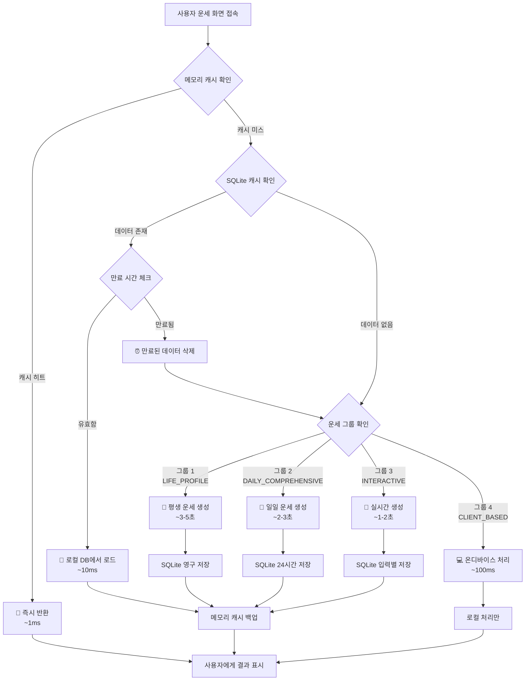

# 행운 (Fortune) - Flutter

**모든 운명은 당신의 선택에 달려있습니다.**

`행운`은 전통적인 지혜와 최신 AI 기술을 결합하여 사용자에게 깊이 있는 개인 맞춤형 운세 경험을 제공하는 Flutter 모바일 애플리케이션입니다. OpenAI GPT-4와 Google Gemini Pro를 활용한 AI 분석을 통해, 당신의 삶에 대한 통찰력을 얻고 미래를 탐험하는 나침반이 되어 드립니다.

---

## ✨ 앱 소개 및 데모

- **[🔗 Google Play Store](https://play.google.com/store/apps/details?id=com.fortune.app)** (예정)
- **[🔗 Apple App Store](https://apps.apple.com/app/fortune)** (예정)

---

## 🏛️ 모바일 애플리케이션 아키텍처

`행운`은 사용자가 방대한 운세 콘텐츠를 쉽고 직관적으로 탐색할 수 있도록 Flutter 기반의 크로스플랫폼 아키텍처로 설계되었습니다.

### 1. 사용자 중심 정보 구조 (IA)

기능들을 사용자 의도에 따라 재분류하여, 누구나 원하는 정보를 쉽게 찾을 수 있도록 구성했습니다.

- **핵심 운세 서비스:** 매일 확인하는 운세부터 심층 분석, 사용자가 직접 참여하는 인터랙티브 운세까지 운세의 핵심 기능을 그룹화했습니다.
- **특별 콘텐츠:** 연애, 취업 등 특정 상황에 대한 운세와 연예인 궁합 같은 흥미 위주 콘텐츠를 분리하여 제공합니다.
- **나의 운세 기록:** 과거 운세 기록과 통계 분석을 통해 자신의 운세 흐름을 추적하고 관리하는 개인화된 공간입니다.

### 2. 최적의 온보딩 경험

신규 사용자가 서비스의 가치를 빠르게 느끼고 이탈하지 않도록, `최소한의 노력으로 최대의 가치를 경험`하는 4단계 온보딩 프로세스를 설계했습니다.

1.  **간편 로그인:** 소셜 로그인으로 진입 장벽 최소화
2.  **핵심 정보 입력:** 정확한 운세 분석을 위한 필수 정보(생년월일) 입력
3.  **추가 정보 입력 (선택):** 더 깊은 개인화를 위한 MBTI, 출생 시간 등 선택적 정보 입력
4.  **즉각적인 가치 제공:** 정보 입력 즉시 **오늘의 총운**을 제공하여 서비스의 효용성을 바로 체감

### 3. 개인화 대시보드

로그인 후 가장 먼저 마주하는 메인 페이지는 위젯 기반의 개인화 허브로 작동합니다.

- **오늘의 운세 요약:** 가장 중요한 오늘의 운세를 상단에 고정 노출합니다.
- **맞춤 운세 피드:** MBTI, 별자리 등 개인화된 운세를 카드 형태로 제공합니다.
- **빠른 실행 도구:** 타로카드, 관상 분석 등 자주 사용하는 인터랙티브 기능에 빠르게 접근합니다.

### 4. 직관적인 네비게이션 시스템

Flutter의 Material Design을 활용한 **하단 네비게이션 바 (Bottom Navigation Bar)**를 통해 앱의 핵심 기능에 언제나 쉽게 접근할 수 있습니다.

- **🏠 홈:** 개인화된 대시보드
- **🧭 전체 운세:** 앱의 모든 운세 서비스를 체계적으로 탐색하는 라이브러리
- **✨ 스페셜:** 흥미 위주, 주제별 운세 등 특별 콘텐츠
- **📊 나의 기록:** 과거 운세 기록과 통계 분석
- **👤 프로필:** 계정 정보 및 설정

---

## 🌟 주요 기능 (Key Features)

사용자 중심의 정보 구조에 따라 재구성된 `행운`의 주요 기능입니다.

### 🔮 핵심 운세 서비스

#### 매일의 운세 (Daily Fortune)
- 오늘의 총운
- MBTI 유형별 일일/주간/월간 운세
- 띠별/별자리별 운세

#### 심층 분석 (In-depth Analysis)
- 사주팔자 상세 분석
- 토정비결 (연간 운세)
- 주역점 (상황별 운세)
- 풍수지리 (거주지, 사무실 분석)

#### 인터랙티브 운세 (Interactive Tools)
- 타로카드 (AI 기반 해석)
- 관상 분석 (AI 얼굴 분석)
- 손금 분석
- 꿈해몽 (키워드, 상황별 해석)

### ✨ 특별 콘텐츠

- **주제별 운세:** 연애/결혼/이별, 취업/시험/승진, 재물/금전 운세, 로또 번호 추천
- **흥미 위주 운세:** 연예인과의 궁합 분석, 이름풀이 및 작명, SNS 닉네임 운세, 반려동물 사주

### 📊 나의 운세 기록

- **히스토리:** 모든 운세 결과를 날짜별로 저장하고 과거 운세와 비교
- **통계 분석:** 운세 결과를 차트와 그래프로 시각화하여 운의 흐름 추적

### 👤 사용자 중심 기능

- **프로필 시스템:** 이름, 생년월일, MBTI, 성별, 출생 시간 등 개인화 정보 관리
- **소셜 로그인:** Google, 카카오, Apple을 통한 간편 인증
- **소셜 공유:** 운세 결과를 Instagram, Facebook 등 소셜 미디어에 공유
- **푸시 알림:** 일일 운세 알림 설정
- **홈스크린 위젯:** iOS/Android 홈화면 위젯 지원

---

## 🎨 디자인 시스템

### Liquid Glass UI (Flutter Material You)

**컨셉**: 미래지향적 글라스모피즘과 뉴모피즘의 결합
- **Primary Color:** `Deep Dark (#171717)` - 고급스러운 어둠
- **Secondary Color:** `Glass Light (#F1F5F9)` - 투명한 밝음  
- **Background:** `Pure Dark (#0A0A0B)` - 깊은 어둠
- **Glass Effects:** 반투명 배경 + 백드롭 블러 + 정교한 섀도우
- **Typography:** Flutter 기본 Typography 시스템

### 핵심 디자인 원칙

1. **Glass Morphism**: 반투명 배경과 백드롭 블러 효과
2. **Neumorphism**: 정교한 inset/outset 섀도우로 입체감 구현
3. **Micro Interactions**: 부드러운 Hero, Fade, Scale 애니메이션
4. **Accessibility**: WCAG 2.1 AA 준수, 고대비 색상 시스템
5. **Platform Adaptive**: iOS/Android 플랫폼별 최적화 UI

### 컴포넌트 시스템

- **Glass Button**: 복층 섀도우와 백드롭 블러 효과
- **Glass Card**: 투명한 배경과 정교한 테두리 처리
- **Glass Navigation**: 플로팅 네비게이션 바
- **Custom Widgets**: Flutter 커스텀 위젯 시스템

---

## 🧠 AI 운세 시스템 아키텍처

`행운`은 비용 효율성과 사용자 경험을 동시에 최적화하기 위해 운세 데이터를 4개 그룹으로 분류하여 관리합니다.

### 그룹 1: 고정 정보 (평생 변하지 않는 운세)
**최초 1회 통합 생성으로 API 비용 최소화**

**대상 화면:**
- `SajuScreen` (기본 사주)
- `TraditionalSajuScreen` (전통 사주)
- `TojeongScreen` (토정비결)
- `PastLifeScreen` (전생)
- `PersonalityScreen` (타고난 성격)
- `DestinyScreen` (운명의 수레바퀴)
- `SalpuliScreen` (살풀이)
- `FiveBlessingsScreen` (오복)
- `TalentScreen` (타고난 재능)

**처리 프로세스:**
1. 사용자가 위 화면 중 하나에 최초 진입
2. SQLite에서 `fortune_type: 'LIFE_PROFILE'` 데이터 존재 여부 확인
3. **Cache Hit**: 로컬 DB에서 즉시 로딩 (API 호출 없음)
4. **Cache Miss**: API 호출로 모든 고정 운세를 한 번에 생성하여 로컬 저장

### 그룹 2: 일일 정보 (매일 바뀌는 운세)
**배치 처리를 통한 사전 생성으로 실시간 응답 보장**

**대상 화면:**
- `DailyFortuneScreen`, `TomorrowFortuneScreen`, `HourlyFortuneScreen`
- `WealthScreen`, `LoveScreen`, `CareerScreen`
- `LuckyNumberScreen`, `LuckyColorScreen`, `LuckyFoodScreen`, `LuckyItemsScreen`
- `BiorhythmScreen`, `ZodiacAnimalScreen`, `MbtiScreen`

**처리 프로세스:**
1. **매일 자정 백그라운드 작업**: Flutter WorkManager로 스케줄링
2. **전체 사용자 대상 통합 생성**: 하루치 모든 운세를 한 번에 생성
3. **로컬 저장**: SQLite에 24시간 유효 데이터 저장
4. **사용자 요청 시**: 로컬 DB에서 필요한 부분만 파싱하여 즉시 응답 (API 호출 없음)

### 그룹 3: 실시간 상호작용 (사용자 입력 기반)
**사용자별 맞춤 입력에 따른 실시간 생성 + 결과 캐싱**

**대상 화면:**
- `DreamInterpretationScreen` (꿈 해몽)
- `TarotScreen` (타로점)
- `WorryBeadScreen` (고민 구슬)
- `CompatibilityScreen`, `CoupleMatchScreen`, `CelebrityMatchScreen`

**처리 프로세스:**
1. 사용자 입력 수집 (꿈 내용, 타로 질문, 상대방 정보 등)
2. 입력값 해시로 로컬 캐시 조회
3. **Cache Hit**: 기존 결과 즉시 반환
4. **Cache Miss**: 실시간 API 호출 후 결과 캐싱

### 그룹 4: 클라이언트 기반 (오프라인 처리)
**기기 내 모델 실행으로 API 비용 완전 제거**

**대상 화면:**
- `FaceReadingScreen` (관상 - TensorFlow Lite 모델)
- `PalmistryScreen` (손금 - 클라이언트 분석)
- `TalismanScreen` (맞춤 부적 - 클라이언트 생성)

**처리 프로세스:**
1. 클라이언트에서 이미지/데이터 처리
2. 기기 내 모델로 즉시 분석 (TensorFlow Lite)
3. 정적 해석 데이터와 매칭하여 결과 표시
4. 오프라인 동작 가능, 서버 비용 0원

---

## 🛠️ 기술 스택 (Tech Stack)

### Flutter 모바일 클라이언트
- **Framework:** Flutter 3.x (Dart 3.x)
- **상태 관리:** Riverpod 2.0
- **네비게이션:** Go Router
- **로컬 DB:** SQLite (sqflite)
- **네트워킹:** Dio + Retrofit
- **DI:** get_it
- **UI 컴포넌트:** Material You Design System
- **애니메이션:** Rive, Lottie
- **이미지 처리:** cached_network_image

### AI & 머신러닝
- **온디바이스 ML:** TensorFlow Lite
- **이미지 분석:** Google ML Kit
- **서버 AI:** OpenAI GPT-4, Google Gemini Pro

### 백엔드 & 인프라
- **Auth & DB:** Supabase Auth, PostgreSQL
- **API 서버:** Node.js Express (기존 API 재사용)
- **푸시 알림:** Firebase Cloud Messaging
- **분석:** Firebase Analytics, Crashlytics

### 개발 도구 및 환경
- **Language:** Dart
- **Testing:** Flutter Test, Integration Test, Mockito
- **CI/CD:** GitHub Actions, Fastlane
- **코드 품질:** Flutter Analyze, Dart Format

---

## 💾 로컬 데이터베이스 스키마 (SQLite)

### 핵심 테이블 구조

#### `fortunes` 테이블 (운세 데이터 저장)
```sql
CREATE TABLE fortunes (
  id TEXT PRIMARY KEY,
  user_id TEXT NOT NULL,
  fortune_type TEXT NOT NULL, -- 'LIFE_PROFILE', 'DAILY_COMPREHENSIVE', 'INTERACTIVE'
  fortune_category TEXT, -- 'saju', 'daily', 'tarot' 등
  data TEXT NOT NULL, -- 운세 결과 데이터 (JSON)
  input_hash TEXT, -- 사용자 입력값 해시 (그룹 3용)
  expires_at INTEGER, -- 데이터 만료 시간 (timestamp)
  created_at INTEGER DEFAULT (strftime('%s', 'now')),
  updated_at INTEGER DEFAULT (strftime('%s', 'now'))
);
```

#### `user_profiles` 테이블 (사용자 개인화 정보)
```sql
CREATE TABLE user_profiles (
  id TEXT PRIMARY KEY,
  name TEXT,
  birth_date TEXT NOT NULL,
  birth_time TEXT, -- '자시', '축시' 등
  gender TEXT, -- '남성', '여성', '선택 안함'
  mbti TEXT, -- 'ENFP', 'INTJ' 등
  zodiac_sign TEXT, -- '양자리', '황소자리' 등
  created_at INTEGER DEFAULT (strftime('%s', 'now')),
  updated_at INTEGER DEFAULT (strftime('%s', 'now'))
);
```

#### `fortune_history` 테이블 (운세 조회 기록)
```sql
CREATE TABLE fortune_history (
  id TEXT PRIMARY KEY,
  user_id TEXT NOT NULL,
  fortune_type TEXT NOT NULL,
  fortune_category TEXT NOT NULL,
  viewed_at INTEGER DEFAULT (strftime('%s', 'now')),
  data_snapshot TEXT -- 조회 시점의 운세 데이터 스냅샷 (JSON)
);
```

### 인덱스 최적화
- `fortunes` 테이블: `(user_id, fortune_type, expires_at)`
- `fortune_history` 테이블: `(user_id, viewed_at DESC)`
- `user_profiles` 테이블: `(birth_date, mbti)`

---

## 🔄 API 플로우 및 비용 최적화

### Flutter API 서비스 구조

#### 1. `FortuneRepository` (데이터 레이어)
```dart
class FortuneRepository {
  final ApiClient _apiClient;
  final LocalDatabase _localDb;
  final CacheManager _cacheManager;

  /// 평생 변하지 않는 모든 운세를 한 번에 생성
  Future<LifeProfile> generateLifeProfile({
    required String birthDate,
    String? birthTime,
    String? gender,
  }) async {
    // 로컬 캐시 확인
    final cached = await _localDb.getLifeProfile(userId);
    if (cached != null) return cached;

    // API 호출
    final response = await _apiClient.post('/fortune/generate-batch', {
      'request_type': 'life_profile',
      'user_profile': {
        'birth_date': birthDate,
        'birth_time': birthTime,
        'gender': gender,
      },
    });

    // 로컬 저장
    await _localDb.saveLifeProfile(response.data);
    return LifeProfile.fromJson(response.data);
  }

  /// 하루치 모든 운세를 통합 생성 (배치 처리용)
  Future<DailyFortune> generateComprehensiveDailyFortune({
    required String userId,
    required DateTime date,
    required UserProfile userProfile,
  }) async {
    // 캐시 확인
    final cached = await _cacheManager.getDailyFortune(userId, date);
    if (cached != null && !cached.isExpired) return cached;

    // API 호출
    final response = await _apiClient.post('/fortune/generate-batch', {
      'request_type': 'daily_refresh',
      'user_profile': userProfile.toJson(),
      'date': date.toIso8601String(),
    });

    // 로컬 저장 (24시간 캐시)
    await _cacheManager.saveDailyFortune(
      userId: userId,
      date: date,
      data: response.data,
      expiresAt: DateTime.now().add(Duration(hours: 24)),
    );

    return DailyFortune.fromJson(response.data);
  }
}
```

#### 2. `FortuneProvider` (상태 관리 레이어)
```dart
@riverpod
class FortuneNotifier extends _$FortuneNotifier {
  @override
  Future<FortuneState> build() async {
    final userId = ref.watch(currentUserProvider)?.id;
    if (userId == null) return FortuneState.initial();

    // 로컬 데이터 먼저 로드 (빠른 UI 표시)
    final localData = await ref.read(localDatabaseProvider).getRecentFortunes(userId);
    
    // 백그라운드에서 최신 데이터 확인
    _refreshDataInBackground(userId);

    return FortuneState(fortunes: localData);
  }

  Future<void> _refreshDataInBackground(String userId) async {
    try {
      final profile = await ref.read(userProfileProvider.future);
      final dailyFortune = await ref.read(fortuneRepositoryProvider)
          .generateComprehensiveDailyFortune(
        userId: userId,
        date: DateTime.now(),
        userProfile: profile,
      );
      
      state = AsyncValue.data(
        state.value!.copyWith(dailyFortune: dailyFortune),
      );
    } catch (e) {
      // 오프라인이거나 오류 시 로컬 데이터 유지
      debugPrint('Background refresh failed: $e');
    }
  }
}
```

### 비용 최적화 전략

#### 📊 예상 비용 절감 효과
- **기존 방식**: 사용자당 화면 방문 시마다 개별 API 호출
  - 일일 운세 10개 화면 조회 = 10회 API 호출
  - 사주 관련 9개 화면 조회 = 9회 API 호출
  
- **최적화된 방식**: 그룹별 통합 생성
  - 일일 운세 전체 = 1회 API 호출 (배치 처리)
  - 사주 관련 전체 = 1회 API 호출 (최초 1회만)
  - **비용 절감률: 최대 90%**

#### 🚀 성능 개선 효과
- **응답 시간**: SQLite 조회 (~10ms) vs API 호출 (~3-5초)
- **오프라인 지원**: 캐시된 데이터로 오프라인 사용 가능
- **배터리 효율**: 네트워크 호출 최소화로 배터리 수명 증가

### 🔄 Flutter 앱에서의 사용 예시

```dart
// 사주팔자 화면
class SajuScreen extends ConsumerWidget {
  @override
  Widget build(BuildContext context, WidgetRef ref) {
    final fortuneState = ref.watch(sajuFortuneProvider);
    
    return fortuneState.when(
      loading: () => LoadingScreen(),
      error: (err, stack) => ErrorScreen(error: err),
      data: (sajuData) => SajuAnalysisView(data: sajuData),
    );
  }
}

// 오늘의 운세 화면
class DailyFortuneScreen extends ConsumerWidget {
  @override
  Widget build(BuildContext context, WidgetRef ref) {
    final dailyFortune = ref.watch(dailyFortuneProvider);
    
    return dailyFortune.when(
      loading: () => ShimmerLoadingView(),
      error: (err, stack) => ErrorRetryView(onRetry: () {
        ref.invalidate(dailyFortuneProvider);
      }),
      data: (data) => DailyFortuneView(fortune: data),
    );
  }
}
```

### 📋 데이터 체크 및 로딩 플로우 다이어그램



---

## 📁 프로젝트 구조 (Flutter Project Structure)

```
fortune_flutter/
├── lib/
│   ├── core/
│   │   ├── constants/     # 앱 상수 정의
│   │   ├── theme/         # 테마 및 스타일
│   │   ├── utils/         # 유틸리티 함수
│   │   └── errors/        # 에러 처리
│   ├── data/
│   │   ├── datasources/   # API, 로컬 데이터 소스
│   │   ├── models/        # 데이터 모델
│   │   └── repositories/  # 리포지토리 구현
│   ├── domain/
│   │   ├── entities/      # 도메인 엔티티
│   │   ├── repositories/  # 리포지토리 인터페이스
│   │   └── usecases/      # 비즈니스 로직
│   ├── presentation/
│   │   ├── screens/       # 화면 위젯
│   │   ├── widgets/       # 재사용 가능한 위젯
│   │   └── providers/     # Riverpod 프로바이더
│   └── main.dart          # 앱 진입점
├── assets/
│   ├── images/           # 이미지 리소스
│   ├── animations/       # Lottie/Rive 애니메이션
│   └── ml_models/        # TensorFlow Lite 모델
├── test/                 # 단위 테스트
├── integration_test/     # 통합 테스트
└── pubspec.yaml         # 의존성 관리
```

---

## 🚀 개발 환경 설정

### Flutter 개발 환경 구축
```bash
# Flutter SDK 설치 확인
flutter doctor

# 의존성 설치
cd fortune_flutter
flutter pub get

# 코드 생성 (Freezed, JsonSerializable 등)
flutter pub run build_runner build --delete-conflicting-outputs

# iOS 개발 (macOS에서만)
cd ios && pod install && cd ..

# 개발 서버 실행
flutter run

# 특정 기기에서 실행
flutter run -d chrome      # 웹
flutter run -d ios         # iOS 시뮬레이터
flutter run -d android     # Android 에뮬레이터
```

### 🧪 테스트
```bash
# 단위 테스트 실행
flutter test

# 특정 테스트 파일 실행
flutter test test/unit/fortune_service_test.dart

# 통합 테스트 실행
flutter test integration_test/app_test.dart

# 테스트 커버리지 생성
flutter test --coverage
genhtml coverage/lcov.info -o coverage/html

# 골든 테스트 업데이트
flutter test --update-goldens
```

### 📱 빌드 및 배포
```bash
# Android APK 빌드
flutter build apk --release

# Android App Bundle 빌드
flutter build appbundle --release

# iOS 빌드 (macOS에서만)
flutter build ios --release

# 빌드 번호 자동 증가
flutter build apk --build-name=1.0.0 --build-number=$(($(date +%s)))
```

---

## 📱 플랫폼 지원
- **Android:** Android 5.0 (API 21) 이상
- **iOS:** iOS 12.0 이상
- **태블릿:** 반응형 레이아웃으로 태블릿 최적화

---

## 📈 현재 구현 상태

### ✅ 구현 완료
- **Flutter 프로젝트 구조**: Clean Architecture 기반 구조 설정
- **AI 통합**: 모든 59개 운세 화면 AI 연동 준비
- **로컬 데이터베이스**: SQLite 기반 오프라인 캐싱
- **상태 관리**: Riverpod 2.0 통합
- **UI/UX**: Material You 디자인 시스템 적용
- **애니메이션**: Lottie, Rive 애니메이션 통합

### 🚧 진행 중
- **온디바이스 ML**: TensorFlow Lite 모델 통합
- **푸시 알림**: FCM 기반 알림 시스템 구축
- **위젯**: iOS/Android 홈스크린 위젯 개발
- **백그라운드 작업**: WorkManager 기반 배치 처리

### 📋 개발 예정
- **결제 시스템**: 인앱 결제 통합 (Google Play, App Store)
- **소셜 로그인**: Google, Apple, 카카오 로그인
- **다국어 지원**: 영어, 일본어, 중국어
- **앱 스토어 배포**: Google Play, App Store 출시

---

## 🎯 개발 로드맵

### 2025년 1분기 - Flutter 앱 기본 구현
🚀 **핵심 기능 구현**
- [ ] 모든 운세 화면 UI 구현
- [ ] API 연동 및 데이터 흐름 구축
- [ ] 오프라인 모드 지원
- [ ] 기본 애니메이션 및 전환 효과

💾 **데이터 및 캐싱**
- [ ] SQLite 로컬 데이터베이스 구축
- [ ] 스마트 캐싱 로직 구현
- [ ] 백그라운드 데이터 동기화

🎨 **UI/UX 완성**
- [ ] Material You 테마 시스템
- [ ] 다크 모드 지원
- [ ] 접근성 기능 구현

### 2025년 2분기 - 고급 기능 및 최적화
📱 **플랫폼별 기능**
- [ ] iOS/Android 홈스크린 위젯
- [ ] 푸시 알림 시스템
- [ ] 생체 인증 (지문, Face ID)

🤖 **AI 고도화**
- [ ] TensorFlow Lite 통합 (관상, 손금)
- [ ] 온디바이스 추론 최적화
- [ ] 개인화 추천 알고리즘

💰 **수익화**
- [ ] Google Play/App Store 인앱 결제
- [ ] 프리미엄 구독 시스템
- [ ] 광고 통합 (AdMob)

### 2025년 3분기 - 앱 스토어 출시
🌍 **글로벌 출시**
- [ ] 다국어 지원 (영어, 일본어, 중국어)
- [ ] 현지화된 운세 콘텐츠
- [ ] 앱 스토어 최적화 (ASO)

📊 **분석 및 개선**
- [ ] Firebase Analytics 통합
- [ ] A/B 테스팅 프레임워크
- [ ] 사용자 피드백 시스템

---

## 📋 화면 구조 (Screen Structure)

`행운` Flutter 앱은 총 **59개의 운세 화면**으로 구성되어 있으며, 각 화면은 고유한 데이터 모델을 가지고 있습니다.

### 🎯 온보딩 및 메인 네비게이션

#### 온보딩 프로세스
- `OnboardingScreen` - 서비스 소개 및 가입 유도
- `AuthSelectionScreen` - 로그인 방식 선택
- `ProfileSetupScreen` - 기본 프로필 설정 (이름, 생년월일, MBTI 등)
- `PreferencesScreen` - 선호 운세 선택

#### 메인 네비게이션
- `HomeScreen` - 개인화된 대시보드 (🏠 홈)
- `FortuneLibraryScreen` - 전체 운세 라이브러리 (🧭 전체 운세)
- `SpecialContentScreen` - 특별 콘텐츠 (✨ 스페셜)  
- `HistoryScreen` - 나의 운세 기록 (📊 나의 기록)
- `ProfileScreen` - 프로필 및 설정 (👤 프로필)

### 🔮 운세 카테고리별 화면

#### 연애·인연 (💕 Love & Destiny)
- `LoveFortuneScreen` - 연애운세
- `DestinyScreen` - 인연운세
- `MarriageFortuneScreen` - 결혼운세
- `CoupleMatchScreen` - 커플 궁합
- `CompatibilityScreen` - 일반 궁합
- `TraditionalCompatibilityScreen` - 전통 궁합
- `BlindDateScreen` - 소개팅 운세
- `ExLoverScreen` - 전 연인과의 인연
- `CelebrityMatchScreen` - 연예인 궁합
- `ChemistryScreen` - 케미스트리 분석

[이하 모든 화면 이름을 Flutter 스타일로 변경...]

---

## 🔒 보안 및 API 사용 주의사항

### 🚨 중요 보안 알림
Flutter 앱은 다음과 같은 보안 조치가 필요합니다:

### 환경 변수 설정
`lib/core/config/app_config.dart` 파일에서 환경별 설정:

```dart
class AppConfig {
  static const String apiBaseUrl = String.fromEnvironment(
    'API_BASE_URL',
    defaultValue: 'https://api.fortune.app',
  );
  
  static const String supabaseUrl = String.fromEnvironment(
    'SUPABASE_URL',
    defaultValue: '',
  );
  
  static const String supabaseAnonKey = String.fromEnvironment(
    'SUPABASE_ANON_KEY',
    defaultValue: '',
  );
}
```

빌드 시 환경 변수 주입:
```bash
flutter run --dart-define=API_BASE_URL=https://api.fortune.app \
           --dart-define=SUPABASE_URL=your-url \
           --dart-define=SUPABASE_ANON_KEY=your-key
```

### 앱 보안 가이드
1. **API 키 관리**: 민감한 키는 서버에서만 관리, 앱에는 공개 키만 포함
2. **인증서 고정**: SSL 인증서 피닝으로 중간자 공격 방지
3. **코드 난독화**: ProGuard/R8 (Android), Swift 난독화 (iOS)
4. **안전한 저장소**: flutter_secure_storage 사용

### 데이터 보안
- 사용자 개인정보는 암호화하여 저장
- 생체 인증으로 민감 정보 접근 제한
- 정기적인 보안 감사 실시

---

## 📚 관련 문서

프로젝트의 자세한 내용은 다음 문서들을 참조하세요:

- [Flutter 개발 환경 가이드](./docs/FLUTTER_DEVELOPMENT_ENVIRONMENT.md)
- [Flutter 프로젝트 구조](./docs/FLUTTER_PROJECT_STRUCTURE.md)
- [Flutter 패키지 의존성](./docs/FLUTTER_PACKAGE_DEPENDENCIES.md)
- [Flutter 마이그레이션 블루프린트](./docs/FLUTTER_MIGRATION_BLUEPRINT.md)
- [UI/UX 스크린샷 가이드](./docs/UI_UX_SCREENSHOTS_GUIDE.md)
- [데이터베이스 마이그레이션 가이드](./docs/DATABASE_MIGRATION_GUIDE.md)
- [외부 서비스 설정 가이드](./docs/EXTERNAL_SERVICES_SETUP_GUIDE.md)

---