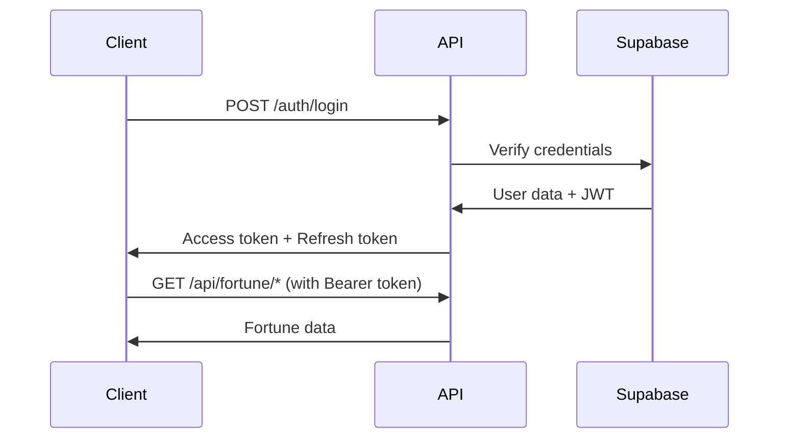

# 🚀 Fortune API 서버 가이드

## 📋 목차
1. [개요](#개요)
2. [API 사양](#api-사양)
3. [마이그레이션 전략](#마이그레이션-전략)
4. [기술 스택](#기술-스택)
5. [API 엔드포인트](#api-엔드포인트)
6. [클라이언트 통합](#클라이언트-통합)
7. [보안 및 인증](#보안-및-인증)
8. [에러 처리](#에러-처리)
9. [캐싱 전략](#캐싱-전략)
10. [모니터링 및 운영](#모니터링-및-운영)

## 개요

Fortune API는 AI 기반 운세 서비스를 제공하는 RESTful API입니다. 현재 Next.js API Routes로 구현되어 있으며, 독립적인 Express.js 서버로 마이그레이션 계획이 있습니다.

### 현재 상황
- **총 API 수**: 84개
  - 운세 생성: 59개 (`/api/fortune/*`)
  - 인증: 6개 (`/api/auth/*`)
  - 결제: 10개 (`/api/payment/*`)
  - 사용자: 4개 (`/api/user/*`, `/api/profile/*`)
  - 관리자: 3개 (`/api/admin/*`)
  - 기타: 2개 (`/api/cron/*`, `/api/errors/*`)

### Base URL
```
Production: https://fortune-explorer.vercel.app/api
Development: http://localhost:3000/api
```

## API 사양

### 표준 응답 형식
```json
{
  "success": true,
  "data": {
    // 응답 데이터
  },
  "metadata": {
    "timestamp": "ISO 8601",
    "fortuneType": "string",
    "userId": "string"
  }
}
```

### 에러 응답 형식
```json
{
  "success": false,
  "error": {
    "code": "ERROR_CODE",
    "message": "Human-readable error message",
    "details": {}
  }
}
```

## 마이그레이션 전략

### Phase 1: API 서버 구축 (1-2주)
- Express.js 기반 독립 서버 구축
- 기존 비즈니스 로직 재사용
- TypeScript 타입 정의 유지

### Phase 2: 점진적 전환 (2-3주)
- Flutter 앱을 새 API로 전환
- 병렬 운영 기간 유지
- A/B 테스트 실행

### Phase 3: 웹 서비스 종료 (1주)
- 모든 트래픽을 새 API로 전환
- 레거시 코드 제거
- 모니터링 강화

## 기술 스택

### 핵심 기술
- **프레임워크**: Express.js (마이그레이션 시)
- **언어**: TypeScript
- **런타임**: Node.js 18+

### 외부 서비스
- **AI**: OpenAI GPT-4
- **인증**: Supabase Auth
- **데이터베이스**: Supabase (PostgreSQL)
- **캐싱**: Redis (Upstash)
- **결제**: Stripe, TossPay

### 개발 도구
- **API 문서**: OpenAPI 3.0
- **테스트**: Jest, Supertest
- **모니터링**: PM2, 커스텀 대시보드

## API 엔드포인트

### 1. 운세 생성

#### 배치 운세 생성
```
POST /api/fortune/generate-batch
```

**Request Body**:
```json
{
  "request_type": "onboarding_complete" | "daily_refresh" | "user_direct_request",
  "user_profile": {
    "name": "string",
    "birth_date": "YYYY-MM-DD",
    "birth_time": "string (optional)",
    "gender": "남성" | "여성" | "선택 안함",
    "mbti": "string (optional)"
  },
  "fortune_categories": ["saju", "daily", "love", "career"]
}
```

### 2. 일일 운세

#### 오늘의 운세
```
GET /api/fortune/daily
```

**Response**:
```json
{
  "fortune_scores": {
    "overall_luck": 0-100,
    "love_luck": 0-100,
    "career_luck": 0-100,
    "wealth_luck": 0-100,
    "health_luck": 0-100
  },
  "insights": {
    "today": "string",
    "advice": "string"
  },
  "lucky_items": {
    "color": "string",
    "number": 0-99,
    "direction": "string",
    "time": "string"
  }
}
```

### 3. 사용자 프로필

#### 프로필 조회
```
GET /api/profile
```

#### 프로필 생성/수정
```
POST /api/profile
```

### 4. 토큰 관리

#### 토큰 잔액 조회
```
GET /api/user/token-balance
```

#### 토큰 사용 내역
```
GET /api/user/token-history
```

### 5. 결제

#### 결제 세션 생성
```
POST /api/payment/create-checkout
```

#### 구독 관리
```
POST /api/payment/create-subscription
POST /api/payment/cancel-subscription
```

## 클라이언트 통합

### Flutter 통합 (Dio + Retrofit)

#### API 클라이언트 설정
```dart
class ApiClient {
  late final Dio _dio;
  
  ApiClient() {
    _dio = Dio(BaseOptions(
      baseUrl: AppConfig.apiBaseUrl,
      connectTimeout: const Duration(seconds: 30),
      headers: {
        'Content-Type': 'application/json',
      },
    ));
    
    _dio.interceptors.addAll([
      AuthInterceptor(),
      LoggingInterceptor(),
      ErrorInterceptor(),
    ]);
  }
}
```

#### Retrofit 서비스 정의
```dart
@RestApi()
abstract class FortuneApiService {
  factory FortuneApiService(Dio dio) = _FortuneApiService;
  
  @POST('/fortune/generate-batch')
  Future<ApiResponse<FortuneData>> generateBatchFortune(
    @Body() BatchFortuneRequest request,
  );
  
  @GET('/fortune/{type}')
  Future<ApiResponse<FortuneData>> getFortune(
    @Path('type') String fortuneType,
  );
}
```

## 보안 및 인증

### 인증 방식
- **현재**: Supabase Auth (JWT)
- **계획**: API Key + JWT 혼합 방식

### 보안 정책
1. **HTTPS 필수**: 모든 통신 암호화
2. **Rate Limiting**: 
   - 무료: 100 요청/일
   - 프리미엄: 1000 요청/일
3. **API Key 관리**: 환경 변수 사용
4. **CORS 설정**: 허용된 도메인만 접근

### 인증 플로우


## 에러 처리

### 에러 코드
- `INVALID_REQUEST`: 잘못된 요청 파라미터
- `UNAUTHORIZED`: 인증 필요
- `INSUFFICIENT_TOKENS`: 토큰 부족
- `RATE_LIMIT_EXCEEDED`: 요청 한도 초과
- `GENERATION_FAILED`: AI 생성 실패
- `PROFILE_NOT_FOUND`: 사용자 프로필 없음

### 에러 처리 예시
```typescript
// Express 에러 미들웨어
export const errorHandler = (
  err: Error,
  req: Request,
  res: Response,
  next: NextFunction
) => {
  const status = err.status || 500;
  const message = err.message || 'Internal Server Error';
  
  res.status(status).json({
    success: false,
    error: {
      code: err.code || 'UNKNOWN_ERROR',
      message,
      details: process.env.NODE_ENV === 'development' ? err.stack : undefined
    }
  });
};
```

## 캐싱 전략

### 캐싱 그룹
1. **평생 캐시** (Group 1)
   - 사주, 성격, 전생
   - 만료 없음

2. **일일 캐시** (Group 2)
   - 일일 운세, 행운 아이템
   - 24시간 캐시

3. **주간 캐시** (Group 3)
   - 상호작용 운세 (동일 입력)
   - 7일 캐시

4. **실시간** (Group 4)
   - 타로, 꿈해석
   - 캐시 없음

### Redis 캐시 구현
```typescript
// 캐시 키 생성
const getCacheKey = (userId: string, fortuneType: string): string => {
  return `fortune:${userId}:${fortuneType}:${getDateString()}`;
};

// 캐시 조회 및 설정
const getCachedFortune = async (key: string) => {
  const cached = await redis.get(key);
  if (cached) return JSON.parse(cached);
  
  const fortune = await generateFortune();
  await redis.setex(key, CACHE_DURATIONS[fortuneType], JSON.stringify(fortune));
  
  return fortune;
};
```

## 모니터링 및 운영

### 헬스체크
```
GET /health
GET /api/health/db
GET /api/health/redis
```

### 메트릭 수집
- **응답 시간**: < 500ms 목표
- **에러율**: < 1% 목표
- **동시 접속**: 1000+ 처리
- **토큰 사용량**: 실시간 추적

### 로깅
```typescript
// Winston 로거 설정
const logger = winston.createLogger({
  level: 'info',
  format: winston.format.json(),
  transports: [
    new winston.transports.File({ filename: 'error.log', level: 'error' }),
    new winston.transports.File({ filename: 'combined.log' })
  ]
});
```

### 배포 체크리스트
- [ ] 환경 변수 설정
- [ ] 데이터베이스 마이그레이션
- [ ] Redis 연결 확인
- [ ] 외부 서비스 API 키 검증
- [ ] 헬스체크 통과
- [ ] 부하 테스트 완료
- [ ] 모니터링 대시보드 설정
- [ ] 백업 계획 수립

---

*최종 업데이트: 2025년 1월 11일*  
*버전: 2.0.0*